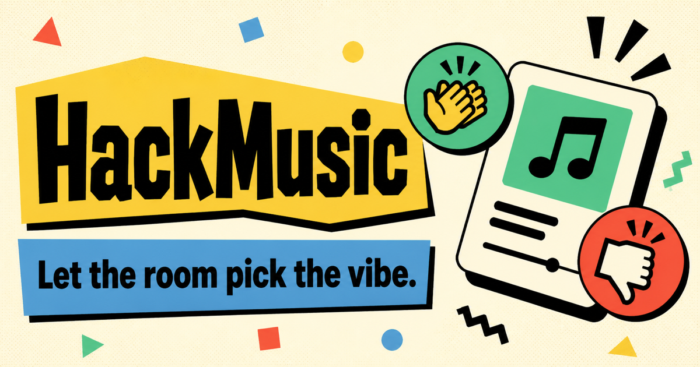
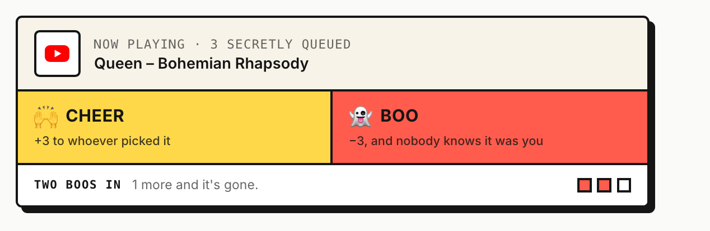
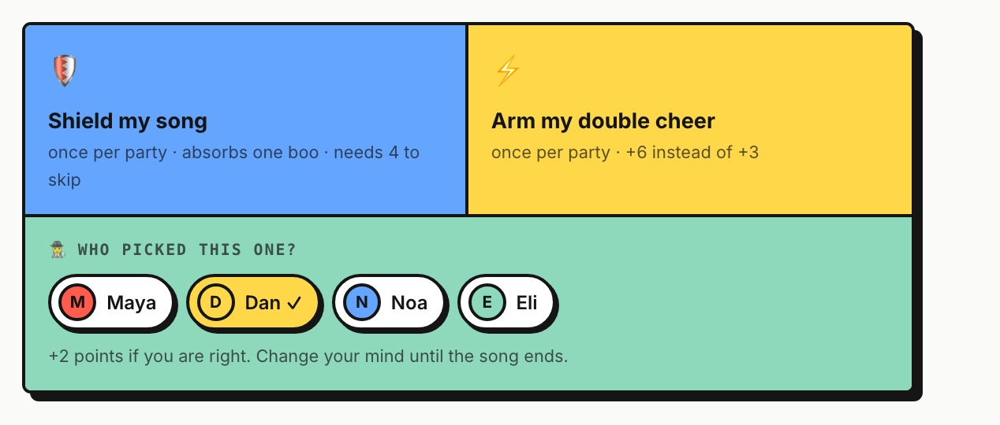
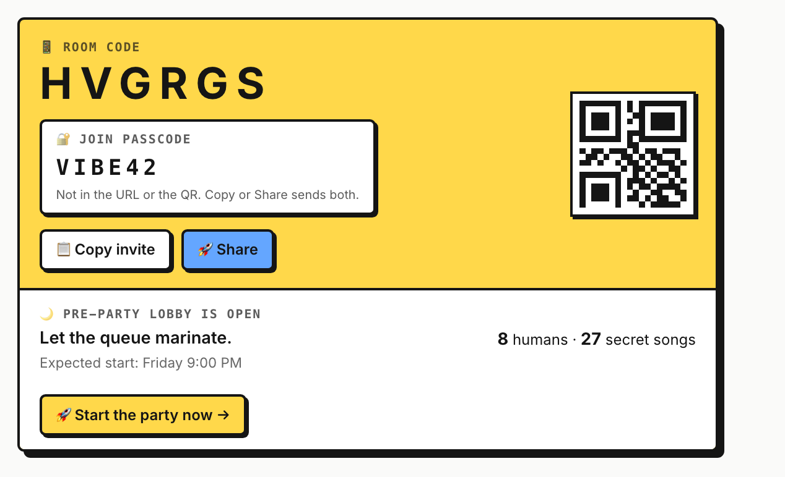
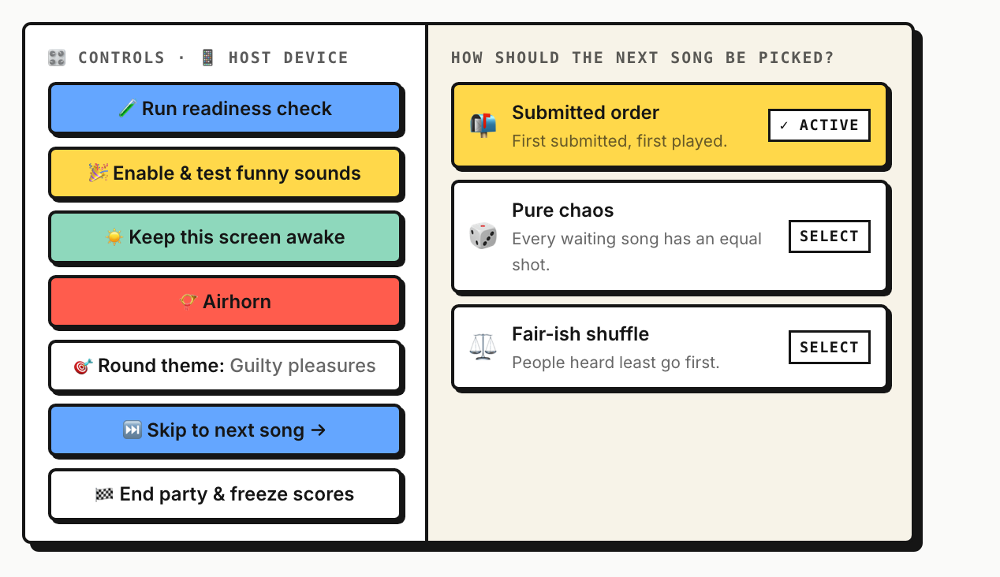
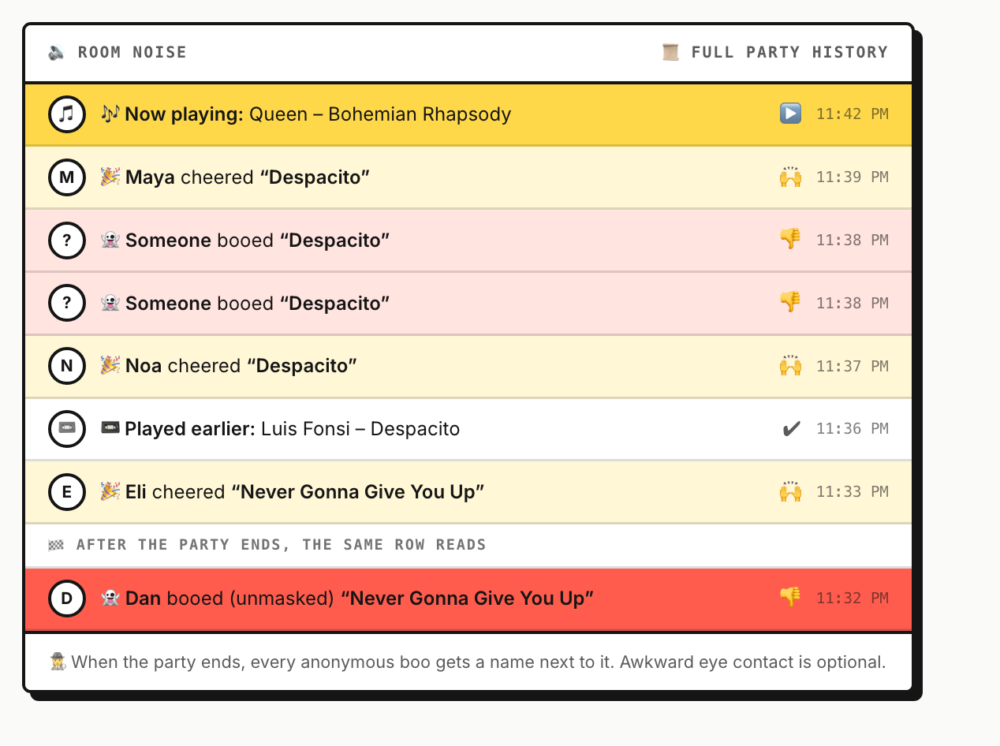
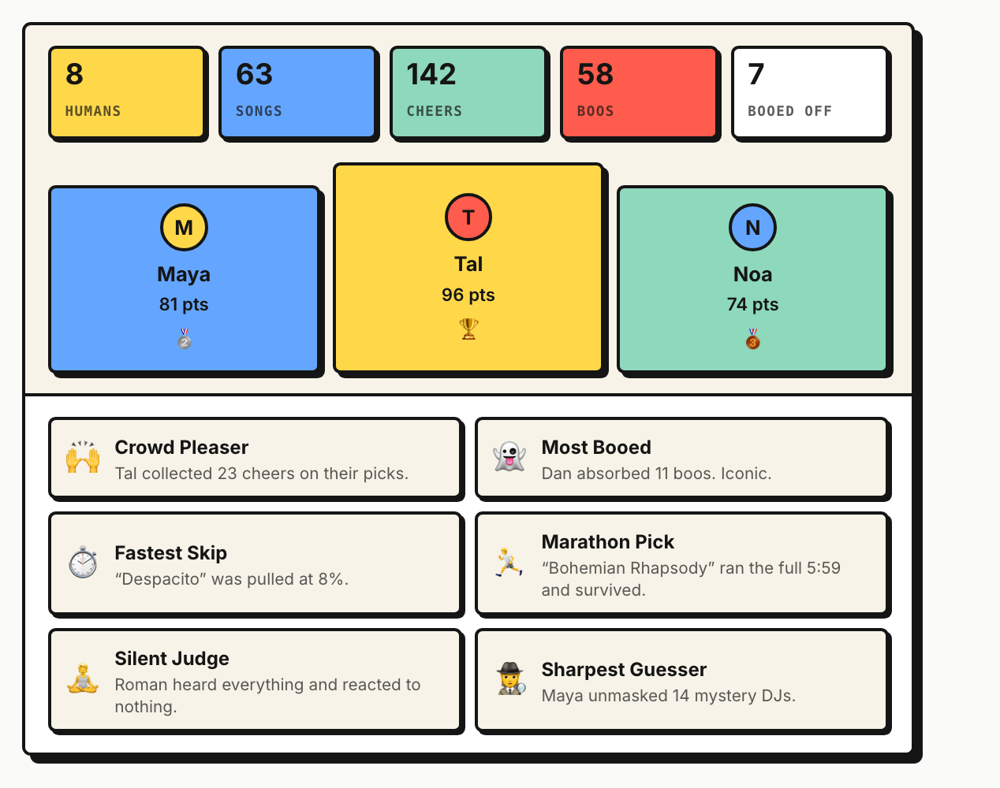

<p align="center">
  
</p>

# 🎉 HackMusic

**Let the room pick the vibe.**

One speaker. A crowd with opinions. Guests secretly queue songs, everyone cheers or boos, and three boos pull the plug. Scores stay hidden until the party ends. No app, no accounts for guests, no playlist dictators.

🌐 Play at **[hackmusic.fun](https://hackmusic.fun)** · 📖 Read the **[illustrated tour](https://sromku.com/hackmusic/index.html)**

---

## 🎮 How a party works

1. **Host creates a room.** Pick Spotify or YouTube, set a passcode, share the six-character code.
2. **Guests join from their phones.** Paste a song link. Nobody sees what is coming next.
3. **The speaker plays.** Every song is a mystery until it drops.
4. **React out loud.** One reaction per song per person. Cheers are signed. Boos are anonymous.
5. **The crowd can skip.** Three boos and the next secret song starts.
6. **End the party.** Scores are revealed, boos are unmasked, awards are handed out.

<p align="center">
  
</p>

### The scoreboard

| Move | Points |
| --- | --- |
| Everyone starts with | 30 |
| Your song gets a cheer | +3 |
| Your song gets a boo | −3 |
| Guess the mystery DJ correctly | +2 |
| Your song gets a **double** cheer | +6 |

The vote locks the moment it lands, you cannot vote on your own song, and the first three seconds of every song are a grace period so a late boo cannot hit the wrong track.

### Power-ups and the detective game

<p align="center">
  
</p>

- 🛡️ **Shield.** Once per party. Goes on your own song while it plays. The first boo costs nothing and it takes four boos, not three, to pull it.
- ⚡ **Double cheer.** Once per party. Your next cheer is worth +6.
- 🕵️ **Guess the DJ.** While any song plays, guess who picked it. Right guess is +2 when the song ends. Change your mind until then.
- 🔥 **Flair.** A row of emoji that lands on the host screen. Unscored, purely for drama.
- 🎯 **Round theme.** The host names the night and guests see it when they add a song.

### Two flavors of room

| | Spotify room | YouTube room |
| --- | --- | --- |
| Host needs | Spotify Premium | Nothing |
| Guests need | Nothing | Nothing |
| Plays | Full tracks through the host device | Videos on the host screen |
| Guests paste | Spotify track links | YouTube video links, Shorts, youtu.be |

The source is locked when the room is created. Links from the other service are politely declined. Spotify hosts bring their own Spotify app Client ID and sign in with PKCE, so no Spotify secret exists anywhere in this project.

## 🖥️ The screens

### Before the party

<p align="center">
  
</p>

The room code is in the invite link and the QR. The passcode is not, so a screenshot of the QR alone gets nobody in. The room can start right away or open as a **pre-party lobby** days early: guests join, pick a name and hide songs in the queue, while playback and reactions stay locked until the host presses start.

### The host's corner

<p align="center">
  
</p>

The host device is the speaker. A readiness check arms the sounds, asks for the wake lock and probes playback. Funny sounds duck the music, play a cheer or a boo, and bring the music back. There is an airhorn. The queue plays in submitted order, at random, or with a fair-ish shuffle that serves the people heard least first. A tired host can pass the aux with a one-use link that works for ten minutes.

### Room noise

<p align="center">
  
</p>

A live feed of everything the room has done: every song, every cheer with a name on it, every boo signed by nobody. When the party ends, the same rows are rewritten in place with the booer's name. Awkward eye contact is optional.

### The Hall of Fame

<p align="center">
  
</p>

Podium, final scores, and six awards computed from what actually happened: Crowd Pleaser, Most Booed, Fastest Skip, Marathon Pick, Silent Judge, Sharpest Guesser. Then the receipts: who booed whom, the pair that cheered each other most, the villain, the saint, the ghosts who never voted. Plus a recap card drawn in the browser to share in the group chat.

### Small things

- **Move your seat.** A one-use QR moves a guest from laptop to phone with their songs, score and reactions, and locks the old device out.
- **My music.** Every guest sees the songs they added, what happened to each, and every reaction they gave.
- **Party face.** An emoji avatar picked at join time, and a name that can change mid-party.
- **Last-song card.** After each song: played or skipped, at what percent, how many guessed right.
- **Remembered rooms.** The home page keeps a browser-local list of rooms this device hosted. No account.
- **Lab.** A development-only page that shows the host plus up to eight fake guests in one browser, for testing without a pile of phones.

## 🛠️ Run it locally

Requires Node.js 22.13 or newer.

```bash
npm install
cp .env.example .env.local   # fill in the values
npm run dev
```

| Variable | Purpose |
| --- | --- |
| `SPOTIFY_COOKIE_SECRET` | 32+ random characters used to encrypt the host's Spotify session cookie |
| `ADMIN_ALLOWED_EMAILS` | Comma-separated emails allowed into the owner dashboard |
| `ADMIN_SECRET_PATH` | Random slug (16+ chars) that becomes the owner dashboard URL, `/backstage/<slug>`. Unset means no dashboard. |

Checks:

```bash
npm run lint
npm test        # builds the real worker, then runs the flow tests
npm run build
```

## 🧱 Stack

- **React 19** and **Next.js** app router, built with [vinext](https://github.com/cloudflare/vinext) and Vite
- **Cloudflare Workers** runtime with **D1** (SQLite) through **Drizzle ORM**
- **Tailwind CSS 4**
- Spotify Web Playback SDK with PKCE, and the YouTube IFrame player
- Hosted on OpenAI Sites; deploys use short-lived credentials, nothing is stored in the repo

## 🗺️ Project map

```
app/            pages, client components, and thin HTTP route shells
app/api/party/  the party API: parse, validate, dispatch
db/             party use cases, queue policy, awards, recap, backups
lib/            shared contracts, link parsing, formatting, security helpers
drizzle/        SQL migrations
tests/          end-to-end flows against the built worker and an in-memory D1
worker/         Cloudflare Worker entry with security headers
docs/screens/   the UI cards used in this README
```

Routes stay thin, domain logic lives in `db/`, and the UI consumes shared contracts from `lib/party-contract.ts`.

## 🔒 Rules the server enforces

The interface hides what it should, but none of the rules live only there. Each one is checked on the server, and each one has a test that sends real requests through the built worker.

- Host controls need a host key. Joining needs the room passcode.
- A track appears once per event. One reaction per person per song. No reacting to your own song.
- Song pickers and boo identities stay hidden until the party ends.
- Scores are hidden until the host ends the event.
- Rooms cap at 100 participants and 100 pending songs per person.
- Cross-origin writes are rejected and room creation is rate-limited.

The owner dashboard lives at a secret path that exists only in the hosting environment, and it requires ChatGPT sign-in plus an email allowlist. Any other path under `/backstage/` is a plain 404. It is read-only, never returns host keys, and never shows who booed. Its backup export is encrypted in the owner's browser before download and can be verified with `npm run backup:decrypt`.

Website analytics are home-made and cookie-free: a visit id is hashed with the day, Do Not Track is honoured, and rows expire after ninety days.

Never commit `.env*` files other than `.env.example`, host keys, passcodes, or database exports.

## 🙏 Credits

Reaction sounds come from Pixabay under the Pixabay Content License. See `public/sounds/ATTRIBUTION.md`.

Scrambled by [Roman Kushnarenko](https://sromku.com) with an AI coding agent. AGI unlocked, common sense still in beta.

## 📄 License

[MIT](LICENSE)
